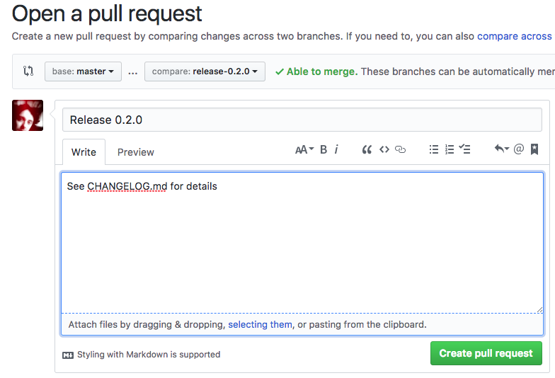
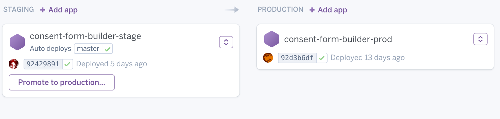

# Barnardos consent form generator

The purpose of the consent form generator is to allow a Barnardos researcher to
enter details about an upcoming research session and produce consent forms that can
initially be paper signed by a participant, and later be digitally signed.

## Developer guide

The following sections of the readme outline the software stack used to create the application,
how to get the application running and how to make and submit changes.

For this repo, we are using [prettier](https://prettier.io/) to handle formatting of our JS / json / Markdown / scss files.
The [prettier documentation](https://prettier.io/docs/en/editors.html) explains how you can install the plugin to your IDE.
You can also run `yarn format` to format your files.

### Stack

The consent form service is built on Ruby on Rails 5 and uses Sass as a CSS preprocessor and
Webpack/Babel/Yarn to handle client side javascript transpilation and dependency management.

Data is stored in Postgresql.

The service comes with configuration files to allow it to be deployed to Heroku or any Docker container
service.

### Installation

There are two ways in which you can install the service, either natively on your machine or
using [Docker](https://www.docker.com/). The easiest way to get started is to use Docker as it takes care of all the
installation steps for you: install Docker, checkout the source and
tell it to start.

If you do not wish to use Docker, but want to make the app run natively on your machine, it just takes a few more steps. See Native Installation below.

### Docker installation

#### Requirements

* A computer that can run Docker
* Docker

#### Steps

* If you haven't already, install Docker. For Windows install [Docker for Windows](https://www.docker.com/docker-windows)
  For mac install [Docker for Mac](https://www.docker.com/docker-mac) and for Ubuntu [Install via package manager](https://docs.docker.com/engine/installation/linux/docker-ce/ubuntu/#uninstall-old-versions). Additionally for

Ubuntu you should install [Docker Compose](https://docs.docker.com/compose/install/#install-compose).

* Checkout the repo via git `git@github.com:barnardos/consent-form-builder-rails.git` or
  [download it here](https://github.com/barnardos/consent-form-builder-rails/archive/master.zip).
* Open a bash prompt or powershell prompt and goto the project folder.
* Type `docker-compose up`.
* Wait a few minutes (the first run may take a while, go grab some coffee) while the application builds and after a while
  you should see a message saying the server started and is listening on port 3000.
* Goto [http://localhost:3000](http://localhost:3000).

#### Development with Docker

Docker mounts your local source folders into the Docker containers, this
means when you make any changes to the source locally, they will show up on the site. In addition to
this the Docker version also runs Webpacker in watch mode, so any changes made to Javascript are instantly
compiled.

### Native installation

#### Requirements

Running the service natively on Windows is not supported, however it can be run using
[WSL](https://msdn.microsoft.com/en-gb/commandline/wsl/about), in any
case open up an Ubuntu prompt and install it from there.

The majority of the installation is actually the dependencies, and there are better guides out there for
each one, so install these and then follow the steps below. If you are not comfortable
installing these yourself, use the Docker version.

* [Ruby](https://www.ruby-lang.org/en/) (>= 2.4.x)
* [Bundler](http://bundler.io/)
* [Node](https://nodejs.org/en/) (>= 8.x though older should work)
* [Yarn](https://yarnpkg.com/en/)
* [Postgresql](https://www.postgresql.org/)

#### Steps

This guide is assuming you are using bash and installing on MacOS or Ubuntu.

* Checkout the repo via git `git@github.com:barnardos/consent-form-builder-rails.git` or
  [download it here](https://github.com/barnardos/consent-form-builder-rails/archive/master.zip).
* Open a bash prompt in the project folder
* Use `bundle install` to install all the Ruby dependecies
* Use `yarn install` to install all the Node dependecies
* Add a user named 'consent' to your postgres instance
* Add a database named 'consent' to your postgres instance, and make 'consent' the owner
* Add a database named 'consent_test' to your postgres instance, and make 'consent' the owner
* Update the database schema using `bundle exec rails db:migrate`
* If you have issues building your test database (`consent_test`), upgrade user to a SUPERUSER, access PostgreSQL in your terminal (`psql postgres`), then `ALTER USER consent WITH SUPERUSER;`. To check user attributes `\du`. Quit `\q`

You can now start the rails server.

#### Starting/Stopping Native

To start the server use `bundle exec rails server`. This will start rails but doesn't handle compiling
javascript.

To start a webpack server, open a second bash prompt and from the project folder enter
`./bin/webpack --watch --progress --colors`. This will start Webpack, compile client side Javascript
and then continue to watch the source files for changes to autocompile.

### Release Guide

#### We maintain a CHANGELOG.md for this project

Its [format](https://github.com/tech-angels/vandamme#format) is as per the recommendations in the
[vandamme](https://github.com/tech-angels/vandamme) gem. Released versions come under headings with
their version number, e.g:

```
# 0.1.0 / 2017-09-19

* [FIX] Margin problem when scrolling the header on mobile
* [FEATURE] Allow users to return to the research session with a bookmark
```

Once released, these sections should be seen as immutable.

As we develop, we continually update an `Unreleased` version at the top of the file:

```
# 0.2.0 / Unreleased

* [FIX] bug #2
* [FEATURE] experimental unicorn
```

We add a line to this file every time a PR is merged and in review on staging. If the merged
PR is reverted due to the rare case of failing review on staging, the line must be removed
as part of the commit reverting the changes. Note the disappearance of the experimental unicorn:

```
# 0.2.0 / Unreleased

* [FIX] bug #2
```

During deployment, and at the same time as tagging, this word `Unreleased` will be
replaced with the ISO8601 (YYYY-MM-DD) date of release.

#### Process

##### 1. Create a new release branch from master

```
git checkout -b release-0.2.0 master
```

##### 2. Replace latest 'Unreleased' entry to be date of release

```
# 0.2.0 / 2017-10-04

* [FIX] bug #2
```

##### 3. Commit this change and push to release branch

```
git add CHANGELOG.md
git commit -m "Release 0.2.0"
git push -u origin release-0.2.0
```

##### 4. Create Pull Request (PR)



It's ok to merge this PR with a cursory review. You may need to wait for a build.

##### 5. Once PR has been merged, tag the release of master we're deploying from (usually HEAD)

Go back to the `master` branch:

```
git checkout master
git tag v0.2.0
git push --tags
```

##### 6. Promote the Heroku release from staging to production

**NB** Ensure the latest commit has been auto-deployed to staging before
promoting. If you don't, it's likely you'll deploy all the changes but not the
CHANGELOG.md commits, which will result in all the behaviour being present but the
wrong SHA showing on production.

From the Heroku pipeline for the app, [promote](https://devcenter.heroku.com/articles/pipelines#promoting)
the release, either from the web UI:



... or alternatively, from the command line, which requires that you have a `git remote` for the staging application. Normally, that would match the `heroku` repo (if you have one of those). In this example, we added a remote with `git remote add consent-form-builder-stage https://git.heroku.com/consent-form-builder-stage.git`:

```
heroku pipelines:promote -r consent-form-builder-stage
Promoting consent-form-builder-stage to example (production)... done, v23
Promoting consent-form-builder-stage to example-admin (production)... done, v54
```

_Todo_

* Add details of Rake tasks for running tests
* Add link to guidelines for making changes and submitting PR's
* How to ask for help or suggest changes via Github issues
